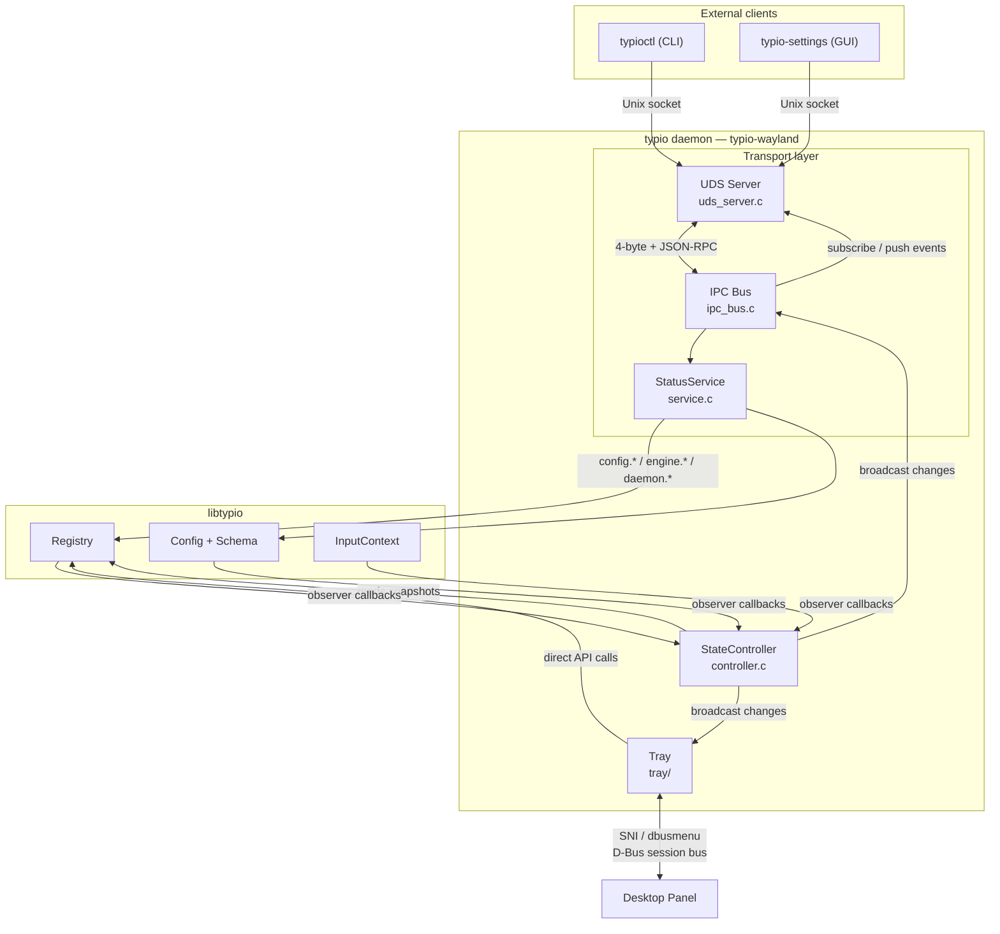
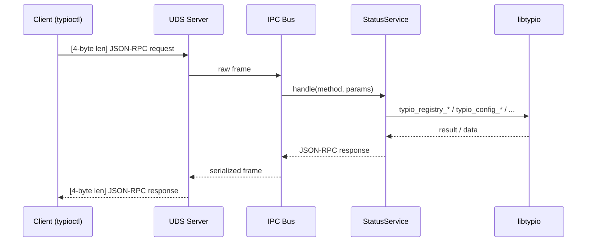
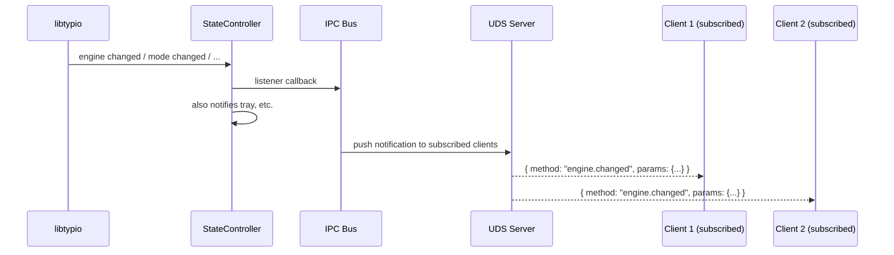
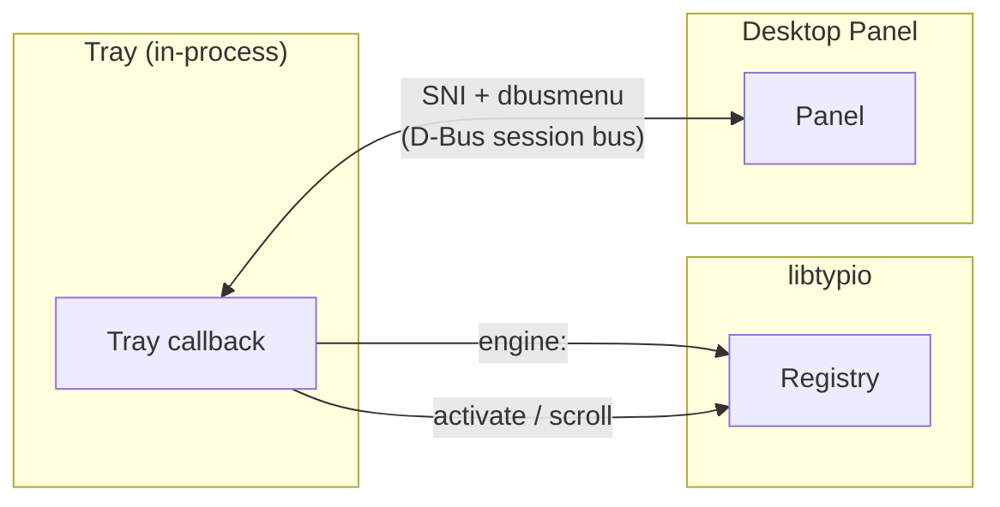
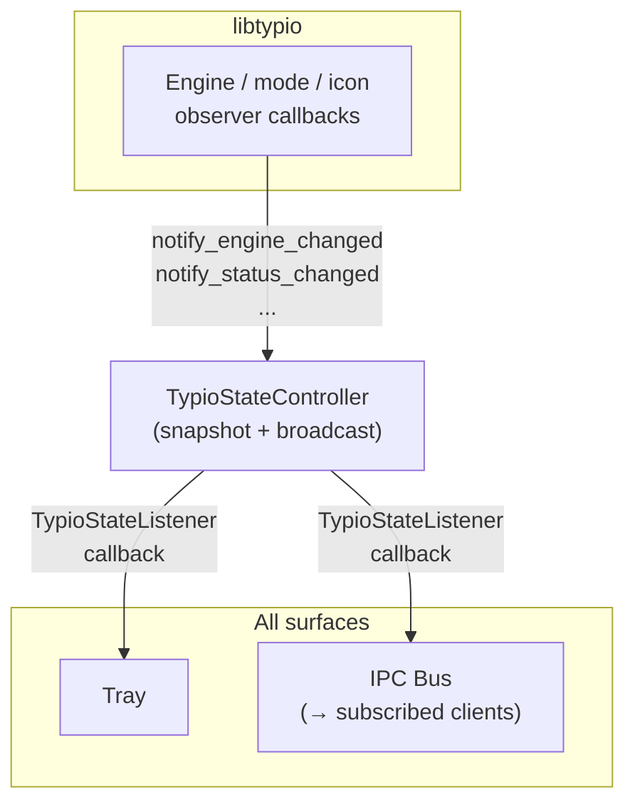

# Control Surfaces

This document covers typio-wayland's control surfaces: the transport mechanisms
by which external tools and in-process UI observe and manipulate daemon state.

The business logic behind every operation (config schema, engine registry,
activation rules, config persistence) is owned by libtypio. typio-wayland
provides the transport layer that carries those operations to and from
consumers.

## Architecture Overview

Three surfaces, three communication patterns:

| Surface | Location | Transport | Reaches libtypio via |
|---------|----------|-----------|----------------------|
| **IPC Bus** (TIP v1) | External processes | UDS + JSON-RPC 2.0 | `TypioStatusService` → libtypio APIs |
| **System Tray** | In-process | D-Bus SNI to desktop panel | Direct `typio_registry_*` calls |
| **Desktop Notifications** | In-process | D-Bus to notification daemon | One-way output, no libtypio |

There is **no D-Bus control interface**. The previous
`org.typio.InputMethod1` adapter was removed (ADR-0008) because parallel UDS
and D-Bus transports for the same operations created a dual-source-of-truth
burden. D-Bus is retained only for `StatusNotifierItem` (tray) and
`org.freedesktop.Notifications` (alerts).

## TIP v1 — External Control Transport

All external control goes through a single Unix Domain Socket carrying
length-prefixed JSON-RPC 2.0, defined as **TIP v1**. See
[IPC Protocol Reference](../reference/ipc-protocol.md) for the method and
event catalog.

### Request flow

The service is transport-agnostic — it receives a method string and a JSON
params object, delegates to the corresponding libtypio API, and returns a
JSON response. It owns no business logic: config keys, engine validation,
activation rules, and persistence are all in libtypio.

### Event push flow

Clients opt in via `events.subscribe`. The IPC bus listens on
`TypioStateController` and forwards every change as a JSON-RPC notification
to all subscribed connections. Unsubscribed connections receive nothing.

### Transport details

- **Socket path**: `$XDG_RUNTIME_DIR/typio/daemon.sock`
  (fallback: `~/.local/share/typio/daemon.sock`)
- **Framing**: 4-byte big-endian length prefix + UTF-8 JSON-RPC 2.0 payload
- **Max frame**: 1 MiB
- **Concurrency**: up to 16 client connections; peer UID must match the daemon
  (`SO_PEERCRED`)
- **Protocol version**: `hello` method returns `protocolVersion` for capability
  negotiation

### Client contract

External clients follow an instant-apply pattern:

1. Issue `config.show` or `config.list` to read current state.
2. Mirror each user edit into a `config.set` call for the affected key.
3. Subscribe to `events.subscribe` to detect external writes.

The actual config write, schema validation, and engine notification happen
inside libtypio — the transport layer carries the call and returns the result.

## System Tray

The tray is an **in-process** surface. It lives inside the daemon and
communicates with libtypio through direct API calls, not through UDS or D-Bus.

### Communication with libtypio

The tray binds to `TypioStateController` and registers as a listener. When
engine state or status icon changes, the controller broadcasts to the tray
callback in `bus.c`.

User actions from the context menu call libtypio APIs directly:

| Tray action | libtypio API |
|-------------|-------------|
| `engine:<name>` | `typio_registry_set_active_keyboard()` |
| `activate` / scroll | `typio_registry_next_keyboard()` / `prev_keyboard()` |
| `quit` / `restart` | Process lifecycle (typio-wayland) |

### Communication with the desktop panel

The tray implements two D-Bus protocols for the panel (not the daemon):

- `org.kde.StatusNotifierItem` — icon registration, tooltip, status
- `com.canonical.dbusmenu` — context menu (engine list, restart, quit)

The D-Bus connection fd is polled alongside the Wayland display fd in the main
event loop.

### Tray menu rules

- The engine list should contain keyboard engines only.
- Rime schema choices may appear under a Rime-specific submenu.
- Voice controls should stay out of the tray unless they become a primary
  action.
- The tray icon represents keyboard-engine status. Voice state may appear in
  tooltip, but must not replace the keyboard icon.

## State Controller

`TypioStateController` sits between libtypio and all surfaces, ensuring
consistent state:

The controller:

1. Receives change notifications from libtypio's observer callbacks.
2. Maintains a snapshot of user-visible state (active engine, mode, icon).
3. Broadcasts to all registered `TypioStateListener` instances.

Both the IPC bus and the tray listen to the same controller, so they always
report consistent state. Surfaces never reach into `TypioInstance` directly.

## Desktop Notifications

`TypioNotifier` sends fire-and-forget health alerts via
`org.freedesktop.Notifications` on the D-Bus session bus. It supports coalesced
delivery to avoid flooding the notification daemon during repeated events. This
is a one-way output channel — not a control surface.

## Known Failure Pattern

A class of bug that is easy to reintroduce in external clients:

1. the client starts before the daemon is ready
2. widget setup emits change signals
3. the UI writes a local stage based on widget defaults
4. the user edits one unrelated setting
5. the whole polluted staged config overwrites unrelated daemon config

The mitigation: before the first successful config read, the client must not
write config. Default values belong to the daemon-side schema, not to
client-side widget initialization.

## See also

- [IPC Protocol Reference](../reference/ipc-protocol.md) — TIP v1 method and event catalog.
- [ADR-0008](../adr/0008-ipc-protocol-resource-namespaces-uds-only.md) — why D-Bus control was removed.
- [Project Scope](project-scope.md) — typio-wayland vs. libtypio responsibilities.
