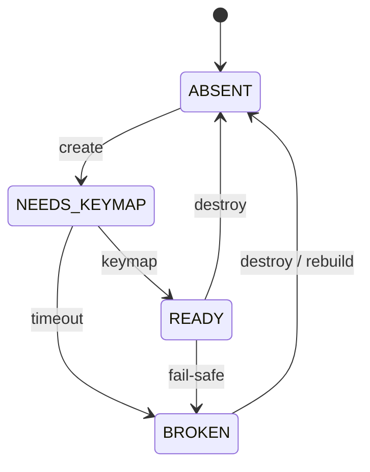

# Focus Controller

## Purpose

The focus controller is the per-tick control loop that manages typio-linux's
Wayland input-method **focus and keyboard-grab lifecycle**: grab create/destroy,
`focus_in`/`focus_out`, keymap epoch scrubbing, and discarding an abandoned
composition on defocus.

It holds **no stored lifecycle phase**. The only persisted things are raw input
facts and live resource handles. Every event-loop tick derives what the
resources *should* be from what has happened, then converges them with a
minimal, idempotent diff — so recovery is the normal path run against changed
facts, not a separate branch.

## Design Declaration

1. **No stored lifecycle phase.** The only persisted things are raw input facts and live resource handles. Every tick derives what the resources *should* be from what has happened.
2. **All effects are idempotent and applied as a diff.** Applying the same `desired` twice is a no-op. Recovery is not a separate code path; it is the normal path run against changed facts.
3. **Decision logic is pure and testable.** `reduce(inputs)` and `diff(desired, actual)` are pure functions. They do not touch the frontend, Wayland, or I/O.
4. **Observe reads presence, not liveness.** The diff converges the host's own state. It cannot detect a resource that is dead but still present as a client-side proxy. That is a structural limitation of the observation layer, not a bug to be patched inside the diff.

## Data Flow

Every event-loop iteration runs one step:

```c
facts   = record(inputs)        /* IM events, suspend gap, POLLHUP */
desired = reduce(facts, prev)   /* pure: what resource config do we want? */
actual  = observe(resources)    /* live snapshot: what do we have? */
effects = diff(desired, actual) /* pure: minimal ops to converge */
apply(effects)                  /* effectful: create/destroy grab, etc. */
```

### Facts

A fact is a recorded event with exactly one source. Facts are never interpreted at arrival.

| Fact | Source |
|------|--------|
| `im_activate_seen` | `zwp_input_method_v2::activate` event handler |
| `im_deactivate_seen` | `zwp_input_method_v2::deactivate` event handler |
| `im_done_had_activate` | `done()` batch classification (distinguishes reactivation from text-state update) |
| `im_done_serial` | `zwp_input_method_v2::done(serial)` |
| `connection_alive` | `POLLHUP` absence on the Wayland socket |
| `suspend_gap_detected` | System resume detector (logind `PrepareForSleep` or boottime-gap heuristic) |

### Desired State

`reduce(facts, prev)` derives the wanted resource configuration. It uses the previous tick's desired state for edge detection on focus_in/focus_out.

```c
typedef enum {
    GRAB_WANT_NONE,        /* Hard teardown: suspend, reconnect, POLLHUP */
    GRAB_WANT_SOFT_PAUSE,  /* Normal deactivate: retain grab for reuse */
    GRAB_WANT_YES,         /* Focus established: grab must exist and be ready */
} TypioWlGrabWant;
```

**Reduce rules:**

- `!connection_alive || suspend_gap_detected` → `NONE`
- `im_deactivate_seen` → `SOFT_PAUSE`
- `im_activate_seen || im_done_had_activate` → `YES`
- Otherwise → preserve `prev.grab`

**Soft pause.** A normal `deactivate` does **not** destroy the grab. The
daemon enters `SOFT_PAUSE`, releases forwarded keys, stops repeat, resets
per-key tracking, and zeros the XKB modifier state — but keeps the grab
object alive. The next `activate` reuses the existing grab, skipping the
expensive xkb keymap compile and the `NEEDS_KEYMAP` window that drops keys.
The soft pause is applied through `keyboard_pause()`.

Only hard boundaries (`suspend_gap_detected` or `connection_alive = false`)
force `NONE`, which triggers a full teardown.

**Focus edge detection:**

- `focus_in`  = (`grab == YES` && `prev.grab != YES`)
- `focus_out` = (`grab != YES` && `prev.grab == YES`)

The edge detection prevents repeated `focus_in`/`focus_out` calls while the state is stable across multiple ticks.

**Reactivate.** A fresh `activate` inside a `done` batch while already `YES` —
the compositor moved focus to a new field in the same window with no
intervening `deactivate` — sets `reactivate`. The grab and the in-flight
composition are preserved; only the panel anchor is refreshed.

### Actual State

`observe(resources)` returns a read-only snapshot of live frontend fields. It is **not** a second source of truth.

```c
typedef enum {
    GRAB_RES_ABSENT,       /* No keyboard grab object */
    GRAB_RES_NEEDS_KEYMAP, /* Grab exists, keymap handoff pending */
    GRAB_RES_READY,        /* Grab exists, keymap synced this epoch */
    GRAB_RES_BROKEN,       /* Keymap path unhealthy (timeout, cancellation) */
} TypioWlGrabResourceState;
```



The grab resource state merges the keyboard grab object presence with the virtual-keyboard keymap readiness from `src/wayland/keyboard/bridge.c`. This is one resource with one state, not a phase plus a separate vk state machine.

**Readiness rules** (the single source of truth for grab readiness):

- creating/rebuilding the grab starts a new epoch and forces `NEEDS_KEYMAP`
- old `READY` must never survive into a new grab epoch
- `READY` requires a compositor keymap observed in the current epoch
- a timeout in `NEEDS_KEYMAP`, or any `BROKEN`, is a fail-safe condition — prefer releasing the grab over forwarding through a partially broken path
- modifier-mask updates may apply while `NEEDS_KEYMAP` (a grab built while a field stays focused), so held Ctrl/Alt/Super survive grab creation before the first new key press; key presses may not

### Effects

`diff(desired, actual)` produces a minimal, idempotent effect set.

| Condition | Effects |
|-----------|---------|
| `grab == NONE`, actual != `ABSENT` | `destroy_grab`, `scrub_generation`, `discard_composition`, `clear_preedit`, `commit` |
| `grab == YES \| SOFT_PAUSE`, actual == `ABSENT` | `create_grab`, `scrub_generation` |
| `grab == YES`, actual == `BROKEN` | `destroy_grab`, `create_grab`, `scrub_generation` |
| `focus_in == true` | `send_focus_in` |
| `focus_out == true` | `send_focus_out`, `discard_composition`, `clear_preedit`, `commit` |
| `reactivate == true` | `reactivate` (panel re-anchor) |

`discard_composition` abandons the engine's in-flight composition and candidate
UI when a field loses focus, so a half-typed attempt cannot leak into the next
field or auto-commit into the one being left. Both defocus paths — soft-pause
(`deactivate`) and hard-teardown (`suspend` / disconnect) — drive it.

### Apply

`apply(effects)` executes in a fixed order, enforced by a compile-time
`_Static_assert` in `focus_effects.c`:

1. `discard_composition` — drop the engine's in-flight composition + candidate UI while still focused
2. `send_focus_out`
3. `destroy_grab` (runs the same teardown path as `focus_hard_reset_keyboard`)
4. `clear_preedit`
5. `commit`
6. `scrub_generation`
7. `create_grab`
8. `send_focus_in`
9. `reactivate` — re-anchor the panel to the new caret

The order matters: the abandoned composition is discarded before focus leaves,
teardown happens before the grab is recreated, and focus enters after the new
grab is ready.

## Per-Tick Workflow

```text
[Wayland dispatch] ──▶ [record facts] ──▶ [reduce] ──▶ [observe] ──▶ [diff] ──▶ [apply]
                                                            ▲
                                                            │
                                                     [live resources]
```

The pipeline runs once per event-loop iteration, after Wayland events have been dispatched and before auxiliary I/O (D-Bus, config reload, voice). This ordering ensures that input facts are fresh before any non-input work can delay the diff.

## Blind Spot: Dead-but-Present Resources

The diff is the backstop for the host's own state, not a detector of external silent loss.

### What the diff cannot see

A resource whose client-side proxy still exists but whose compositor-side state has been silently discarded. The canonical example is a `zwp_input_method_keyboard_grab_v2` object that survives a compositor restart: the client sees a non-null pointer, so `observe()` reports `GRAB_RES_READY`, but the compositor no longer routes key events through it.

Another example is a stuck Wayland connection: the socket is open (`POLLHUP` absent) but the compositor has stopped processing events. `observe()` reports `connection_alive = true`, so `reduce()` keeps `grab = YES`, and the diff produces no effects. The user cannot type, and the controller sees no reason to act.

### Why this is accepted

Detecting silent death requires a liveness probe (heartbeat, roundtrip timeout, or harmless request echo). Any such probe has trade-offs:

- **False positives** during legitimate idle periods (user away from keyboard) cause unnecessary grab teardown and rebuild, producing visible input stalls.
- **Protocol interference**: a periodic harmless request may still mutate client state or increase power use.
- **Threshold problem**: the timeout must be longer than any normal stall (GPU-heavy compositor frame) but short enough that users do not notice the wedge. No single threshold satisfies both.

The accepted mitigation is external fact sources, not the diff:

- **Resume detector**: system suspend/resume is a strong signal that compositor state may be stale. It sets `suspend_gap_detected = true`, forcing a full scrub and rebuild.
- **POLLHUP**: socket death is unambiguous. It sets `connection_alive = false`, forcing teardown.
- **Emergency exit shortcut**: a user-facing escape hatch (`release grab + stop daemon`) for the rare case where silent death occurs without suspend or disconnect.

A future liveness probe may be added as a new fact source feeding into `reduce()`, but it does not belong inside `observe()` or `diff()`.

## Module Boundaries

| Module | Responsibility |
|--------|---------------|
| `src/engine/focus_controller.{c,h}` | `reduce`, `diff`, data structures. Pure, testable without frontend or Wayland. |
| `src/wayland/focus_effects.c` | `observe` (reads frontend fields) and `apply` (mutates frontend/Wayland state). Effectful, tied to `TypioWlFrontend`. |
| `src/wayland/event_loop.c` | Per-tick driver: records facts, calls reduce/observe/diff/apply in order. |
| `src/wayland/keyboard/bridge.c` | Virtual-keyboard state machine (`ABSENT → NEEDS_KEYMAP → READY → BROKEN`). The focus controller reads this state but does not own the transitions. |

## See Also

- [ADR-0003: Session Controller — Derived State, Idempotent Diff](../adr/0003-session-controller-reduce-diff.md) — the architectural decision that introduced this model
- [Input-Method Session](input-method-session.md) — the three layers of "session", build-up chain, and lifecycle rules
- [Event Loop Scheduling](event-loop-scheduling.md) — GPU bounds, D-Bus dispatch, and poll deadlines
- [Wayland Input Method Protocol](wayland-input-method.md) — the protocol whose events feed `reduce`
