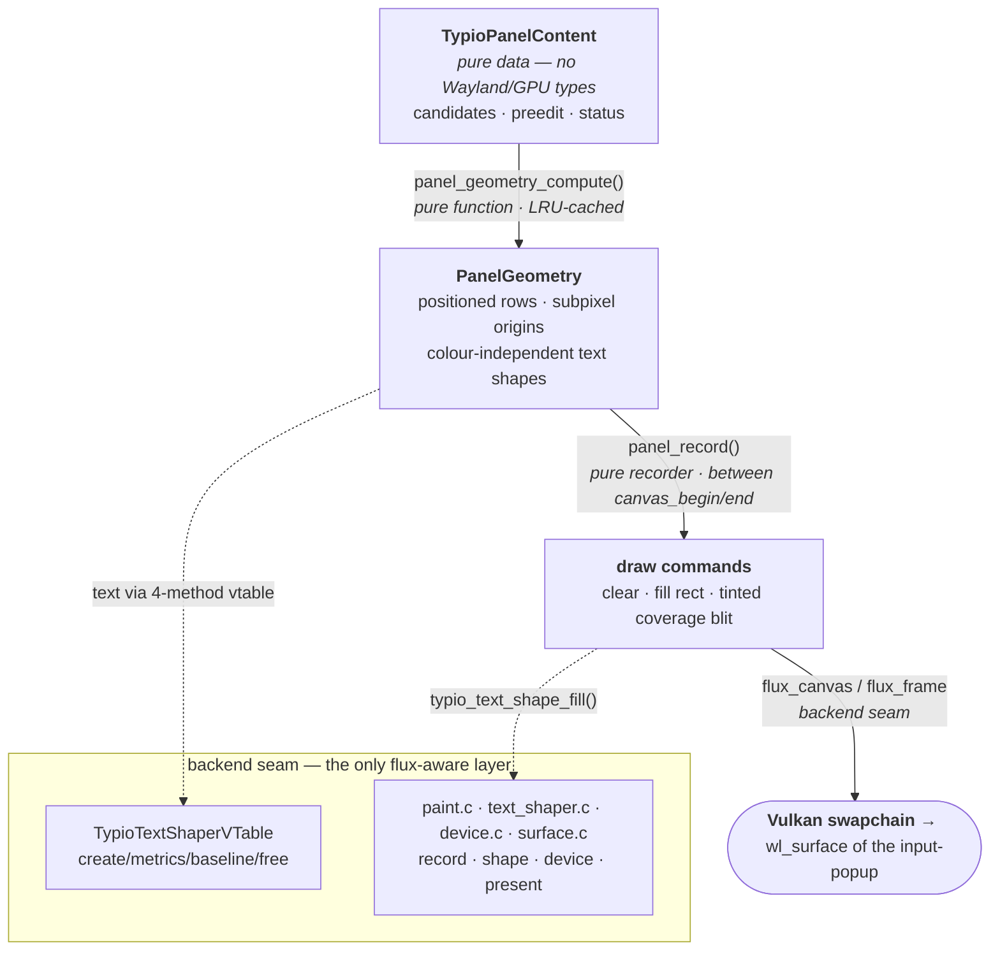

# Frontend Graphics: How the Host Draws, and Why It Doesn't Depend on flux

The host renders exactly one floating UI — the **Panel**: a candidate list plus
preedit decoration and transient status, shown through one **Panel Surface**
backed by the `zwp_input_popup_surface_v2` protocol object (see
[ADR-0005](../adr/0005-unified-panel-backend.md)). It is
drawn on the GPU through [flux](../../flux), a Vulkan canvas library.

> **Vocabulary.** The canonical terms are fixed in
> [ADR-0014](../adr/0014-canonical-panel-vocabulary.md) and implemented under
> `src/ui/panel/` — **Panel** is the UI as a whole; **popup** refers *only* to
> the `zwp_input_popup_surface_v2` protocol object (see the
> [glossary](#glossary)). The identifiers below are the real current code
> symbols, so they remain greppable.

A recurring question is *why so little of the host actually knows about flux*,
and why the rendering flow would survive swapping flux for cairo, skia, or any
other 2-D canvas. The short answer: **GPU canvas libraries all converge on the
same small core abstraction, and the host is written against that abstraction
rather than against flux.** This document explains the pipeline, names the
seam, and makes the independence argument concrete.

## The pipeline, top to bottom

Drawing the panel is a strict, one-directional pipeline. Each stage consumes
the stage above and produces the stage below; no stage reaches back up.

### 1. Content — `TypioPanelContent`

The aggregated, display-agnostic description of *what* should be shown:
candidate list, preedit string, optional status banner. By the rule in
[ADR-0005](../adr/0005-unified-panel-backend.md), this model **must contain no
Wayland and no GPU types** (it lives in `src/ui/panel/content.h`), which is
exactly what lets it be unit-tested with no display server. The frontend builds
it (`panel.c`, `typio_panel_update_content`) and hands it down.

### 2. Layout — `panel_geometry_compute()`

A **pure function** from `content + config + palette + scale` to a
`PanelGeometry` (`src/ui/panel/layout.c`): pixel-aligned row rectangles,
subpixel paint origins, the divider position, panel dimensions, and a handle to
a text *shape* per string. It owns no frame and issues no draw call. Results are
memoised in an LRU cache (`PanelRenderCtx`, capacity `PANEL_LAYOUT_CACHE_CAP`)
keyed by text + font, so paging through candidates does not re-shape text it has
already seen.

Crucially, the text shapes it produces are **colour-independent**: each shape
references a shared R8 *coverage* atlas and the colour is supplied at draw time
as a tint ([ADR-0011](../adr/0011-colour-independent-coverage-glyphs.md),
[ADR-0012](../adr/0012-glyph-atlas-shared-texture.md)). The same glyph can be
drawn normal, muted, or selected without re-shaping or re-uploading — and, more
to the point here, the shape carries no notion of a specific backend's colour or
paint object.

### 3. Paint — `panel_record()`

A **pure recorder** from geometry to draw commands (`src/ui/panel/paint.c`).
Given a canvas and the geometry, it emits exactly three kinds of primitive:

- **clear** — the background colour;
- **fill rect** — border, selection highlight, mode divider;
- **tinted coverage blit** — text, via `typio_text_shape_fill()`.

It does not begin or end the frame, does not present, does not allocate the
surface. The panel surface (`surface.c`) owns the frame lifecycle and calls
`panel_record()` strictly between `flux_canvas_begin` / `flux_canvas_end`.

### 4. The backend seam — paint target, text shaper, device, and surface

This is the only layer that names a concrete graphics library, and it is
deliberately small. It has three parts:

- **Text-shaper vtable** (`src/ui/panel/text_shaper.h`, `TypioTextShaperVTable`):
  four function pointers — `create_layout`, `get_metrics`, `get_baseline`,
  `free_layout`. The layout stage above calls *only* these. The flux/FreeType
  implementation lives behind them in `src/ui/panel/text_shaper.c`. This header
  even records its own history: libtypio once shipped this as a public ABI
  (`typio/abi/renderer.h`) precisely so a host could plug in cairo, skia, or
  flux — the seam predates the current single backend.

  Font resolution uses Fontconfig for discovery, HarfBuzz for shaping, and
  FreeType for rasterisation. When the primary font produces `.notdef` (glyph
  ID 0) for a codepoint, the shaper performs **per-glyph fallback**: it queries
  `FcFontSort` for fonts covering that specific codepoint and verifies each
  candidate with `FT_Get_Char_Index`. Up to four fallback fonts are stored per
  text shape and shared across all glyphs. Font loading also selects a
  format-12 charmap when available, enabling correct lookup of supplementary-
  plane characters (emoji, rare CJK). See
  [ADR-0016](../adr/0016-per-glyph-font-fallback.md).

- **Paint target** (`src/ui/panel/paint.h`): the narrow canvas boundary.
  `panel_record()` receives a `flux_canvas` target today, but it does not own a
  frame or a surface. If the canvas backend changes, this is the small recorder
  layer that changes with it.

- **Canvas / device / surface calls** confined to `paint.c`, `text_shaper.c`,
  `device.c`, and `surface.c`: record clear/fill/blit commands (`paint.c`),
  fill shaped text (`text_shaper.c`), get a lazily-created shared device
  (`typio_render_device_get`, `device.c`), create a surface bound to the
  input-popup `wl_surface`, run the frame lifecycle
  (`flux_surface_begin_frame` → `flux_canvas_begin`/`end` →
  `flux_frame_present`), and recover the swapchain on stall
  (`flux_surface_resize`) — the lifecycle pieces all remain in `surface.c`.

### 5. Present — Vulkan swapchain onto the `wl_surface`

`surface.c` (`TypioPanelSurface`) presents its swapchain directly onto the
input-popup's `wl_surface`. The resilience around this present (bounded acquire,
retry, recover-streak, non-blocking present mode) is its own subject — see
[ADR-0006](../adr/0006-resilient-candidate-popup-present.md) and
[ADR-0010](../adr/0010-non-blocking-candidate-popup-present.md) — and is
orthogonal to everything above it.

## Why this is independent of the specific graphics library

Every 2-D GPU canvas library — flux, skia, cairo's GL backend, a hand-rolled
Vulkan renderer — exposes the **same core abstraction**, because it is dictated
by how GPUs and display servers actually work:

| Core concept | flux name | What every backend must offer |
|---|---|---|
| GPU context | `flux_device` | A device/context you create once and share. |
| Window-bound target | `flux_surface` (+ swapchain) | A surface tied to a native window with a frame queue. |
| Frame lifecycle | `begin_frame` → `present` | Acquire a target image, record, submit, present. |
| Immediate-mode canvas | `flux_canvas` | Clear, fill a rect, blit a textured/coverage region. |
| Text as coverage + tint | R8 coverage + draw-time tint | Shape once to a mask; colour at draw time. |

The host's drawing reduces to *clear, fill rectangles, and blit tinted glyph
coverage* — the lowest common denominator that every one of those libraries
provides. Nothing in the panel needs paths, shaders, blend exotica, or
retained scene graphs. So the dependency surface is not "flux"; it is "a canvas
that can clear, fill, and blit." flux is merely the chosen implementation.

The architecture then enforces that the dependency stays confined:

1. **The content and layout stages never see a GPU type.** `TypioPanelContent`
   is GPU-free by ADR-0005; `PanelGeometry` holds opaque `TypioTextShape*`
   handles, not backend objects.
2. **Text crosses the seam through a four-method vtable**, not through flux
   calls scattered across the frontend.
3. **Colour is decoupled from shaping** (ADR-0011), so shapes carry no
   backend paint state.
4. **Concrete flux calls live at the backend boundary** (`paint.c`,
   `text_shaper.c`, `device.c`, `surface.c`). A no-op `stub.c` already
   implements the entire Panel interface for builds without flux (`HAVE_FLUX`
   off) — proof that the upper pipeline compiles and runs against an empty
   backend.

Porting to another canvas library therefore means rewriting the paint target,
`text_shaper.c` / `device.c`, the present/surface plumbing in `surface.c`, and
the four vtable methods. The content model, layout, LRU cache, theming, and the
entire frontend above them do not change.

## A corollary: graphics and input correctness are decoupled

The same separation explains an observation from debugging: a *frozen panel*
never corrupts *committed text*. Key events queue on the Wayland fd and are
processed in order regardless of what the renderer is doing, so a stalled
compositor (lock, DPMS-off, suspend) lags only the **visible** highlight while
the **committed** selection stays correct
([ADR-0006](../adr/0006-resilient-candidate-popup-present.md)). Rendering sits
downstream of input; it is a consumer of state, never a gatekeeper of it. The
graphics layer is replaceable precisely because nothing essential depends on
it.

## See also

- [ADR-0005 — Unified Panel Backend](../adr/0005-unified-panel-backend.md) — the GPU-free content model.
- [Panel Ontology](panel-ontology.md) — the producer / owner / anchor vocabulary around the Panel.
- [ADR-0006](../adr/0006-resilient-candidate-popup-present.md) / [ADR-0010](../adr/0010-non-blocking-candidate-popup-present.md) — present-side resilience (orthogonal to the pipeline).
- [ADR-0011 — Colour-Independent Coverage Glyphs](../adr/0011-colour-independent-coverage-glyphs.md) — why shapes carry no colour.
- [ADR-0012 — Glyph Atlas Shared Texture](../adr/0012-glyph-atlas-shared-texture.md) / [ADR-0013](../adr/0013-grow-only-popup-swapchain.md) — backend-internal optimisations.
- [ADR-0014 — Canonical Panel Vocabulary](../adr/0014-canonical-panel-vocabulary.md) — the object model and naming.
- [Rendering Code Organization](../dev/rendering-organization.md) — contributor rules for placing UI and backend code.
- [Panel Appearance](../dev/panel-appearance.md) — theming and configuration of what gets drawn.

## Glossary

Canonical terms, per [ADR-0014](../adr/0014-canonical-panel-vocabulary.md). Each
term names one concept; `popup` is reserved for the protocol surface alone. The
code symbol for each appears in parentheses where it differs.

| Term | Meaning |
|---|---|
| **Panel** (`TypioPanel`, `panel.c`) | The floating IME UI as a whole. The orchestrating object: content → geometry, caches, theme, visible/selected state. |
| **Panel Content** (`TypioPanelContent`, `content.h`) | Display-agnostic data describing what to show. Free of Wayland/GPU types; unit-testable. |
| **Zone** | A bounded sub-region of the Panel: Candidate, Preedit, Status, (future) Toolbar. |
| **Layout** (`panel_geometry_compute`, `layout.c`) | Pure function `Content → PanelGeometry`. |
| **PanelGeometry** | Immutable positioned snapshot (rects, origins, dimensions). |
| **Paint** (`panel_record`, `paint.c`) | Pure recorder `PanelGeometry → draw commands` onto a Canvas. |
| **TextShaper → TextShape** (`text_shaper.c`) | Shaping vtable producing colour-independent coverage shapes. Named to avoid colliding with the Layout step. |
| **Panel Surface** (`TypioPanelSurface`, `surface.c`) | The presentation object: input-popup `wl_surface` + swapchain + present/recover loop + retire ring. |
| **RenderDevice** (`device.c`) | The shared, process-wide flux device. |
| **input-popup surface** | The literal `zwp_input_popup_surface_v2` protocol object — the only sanctioned use of "popup". |
| **Canvas / Frame** | flux primitives: immediate-mode recording target / one acquire→present cycle. |
| **Candidate window** | User-facing prose synonym for the Panel when showing candidates. Not a code identifier. |
