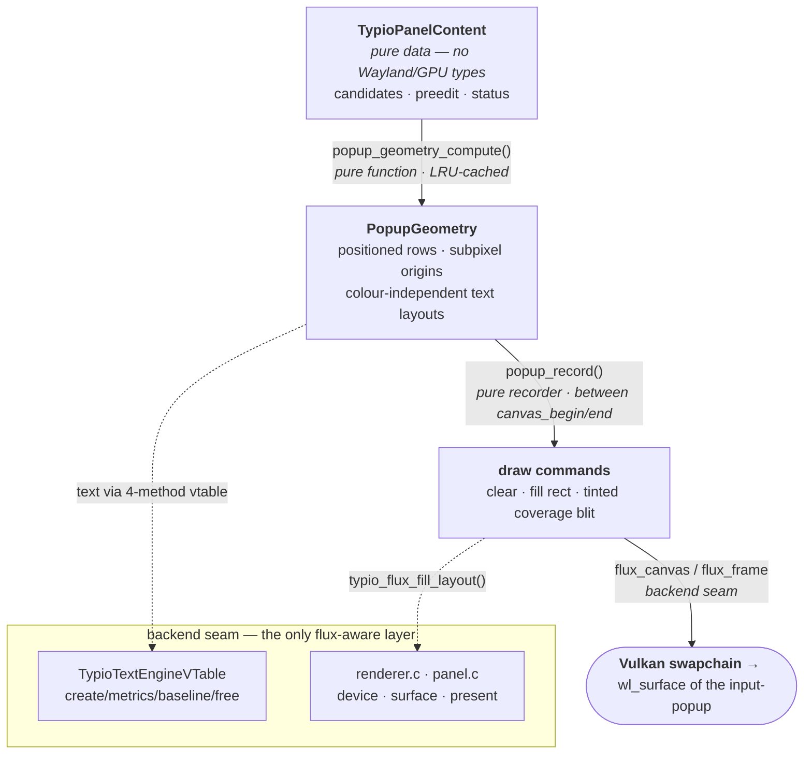

# Frontend Graphics: How the Host Draws, and Why It Doesn't Depend on flux

The host renders exactly one floating UI — the **Panel**: a candidate list plus
preedit decoration and transient status, shown through one **Panel Surface**
backed by the `zwp_input_popup_surface_v2` protocol object (see
[ADR-0005](../adr/0005-unified-panel-backend.md)). It is
drawn on the GPU through [flux](../../flux), a Vulkan canvas library.

> **Vocabulary.** The canonical terms are fixed in
> [ADR-0014](../adr/0014-canonical-panel-vocabulary.md) — **Panel** is the UI as
> a whole; **popup** refers *only* to the `zwp_input_popup_surface_v2` protocol
> object (see the [glossary](#glossary) below). That rename is not yet
> implemented, so the prose below still uses the **current code symbols**
> (`popup`, `PopupGeometry`, `TypioTextEngine`/`TypioTextLayout`) where it points
> at real identifiers, so they remain greppable.

A recurring question is *why so little of the host actually knows about flux*,
and why the rendering flow would survive swapping flux for cairo, skia, or any
other 2-D canvas. The short answer: **GPU canvas libraries all converge on the
same small core abstraction, and the host is written against that abstraction
rather than against flux.** This document explains the pipeline, names the
seam, and makes the independence argument concrete.

## The pipeline, top to bottom

Drawing the popup is a strict, one-directional pipeline. Each stage consumes
the stage above and produces the stage below; no stage reaches back up.

### 1. Content — `TypioPanelContent`

The aggregated, display-agnostic description of *what* should be shown:
candidate list, preedit string, optional status banner. By the rule in
[ADR-0005](../adr/0005-unified-panel-backend.md), this model **must contain no
Wayland and no GPU types**, which is exactly what lets it be unit-tested with
no display server. The frontend builds it (`backend.c`,
`typio_wl_text_ui_backend_update_content`) and hands it down.

### 2. Layout — `popup_geometry_compute()`

A **pure function** from `content + config + palette + scale` to a
`PopupGeometry`: pixel-aligned row rectangles, subpixel paint origins, the
divider position, popup dimensions, and a handle to a text *layout* per string.
It owns no frame and issues no draw call. Results are memoised in an LRU cache
(`PopupRenderCtx`, capacity `POPUP_LAYOUT_CACHE_CAP`) keyed by text + font, so
paging through candidates does not re-shape text it has already seen.

Crucially, the text layouts it produces are **colour-independent**: each layout
owns one R8 *coverage* texture and the colour is supplied at draw time as a
tint ([ADR-0011](../adr/0011-colour-independent-coverage-glyphs.md)). The same
glyph can be drawn normal, muted, or selected without re-shaping or re-uploading
— and, more to the point here, the layout carries no notion of a specific
backend's colour or paint object.

### 3. Paint — `popup_record()`

A **pure recorder** from geometry to draw commands. Given a canvas and the
geometry, it emits exactly three kinds of primitive:

- **clear** — the background colour;
- **fill rect** — border, selection highlight, mode divider;
- **tinted coverage blit** — text, via `typio_flux_fill_layout()`.

It does not begin or end the frame, does not present, does not allocate the
surface. The popup coordinator (`panel.c`) owns the frame lifecycle and calls
`popup_record()` strictly between `flux_canvas_begin` / `flux_canvas_end`.

### 4. The backend seam — text engine vtable + a handful of flux calls

This is the only layer that names a concrete graphics library, and it is
deliberately tiny. It has two parts:

- **Text engine vtable** (`src/ui/text.h`, `TypioTextEngineVTable`): four
  function pointers — `create_layout`, `get_metrics`, `get_baseline`,
  `free_layout`. The layout stages above call *only* these. The flux
  implementation lives behind them in `src/ui/renderer.c`. This header even
  records its own history: libtypio once shipped this as a public ABI
  (`typio/abi/renderer.h`) precisely so a host could plug in cairo, skia, or
  flux — the seam predates the current single backend.

- **Canvas / device / surface calls** confined to `renderer.c` and
  `panel.c`: get a lazily-created shared device (`typio_flux_device_get`),
  create a surface bound to the popup `wl_surface`, run the frame lifecycle
  (`flux_surface_begin_frame` → `flux_canvas_begin`/`end` → `flux_frame_present`),
  and recover the swapchain on stall (`flux_surface_resize`).

### 5. Present — Vulkan swapchain onto the `wl_surface`

flux presents its swapchain directly onto the input-popup's `wl_surface`. The
resilience around this present (bounded acquire, retry, recover-streak,
non-blocking present mode) is its own subject — see
[ADR-0006](../adr/0006-resilient-candidate-popup-present.md) and
[ADR-0010](../adr/0010-non-blocking-candidate-popup-present.md) — and is
orthogonal to everything above it.

## Why this is independent of the specific graphics library

Every 2-D GPU canvas library — flux, skia, cairo's GL backend, a hand-rolled
Vulkan renderer — exposes the **same core abstraction**, because it is dictated
by how GPUs and display servers actually work:

| Core concept | flux name | What every backend must offer |
|---|---|---|
| GPU context | `flux_device` | A device/context you create once and share. |
| Window-bound target | `flux_surface` (+ swapchain) | A surface tied to a native window with a frame queue. |
| Frame lifecycle | `begin_frame` → `present` | Acquire a target image, record, submit, present. |
| Immediate-mode canvas | `flux_canvas` | Clear, fill a rect, blit a textured/coverage region. |
| Text as coverage + tint | R8 coverage + draw-time tint | Shape once to a mask; colour at draw time. |

The host's drawing reduces to *clear, fill rectangles, and blit tinted glyph
coverage* — the lowest common denominator that every one of those libraries
provides. Nothing in the popup needs paths, shaders, blend exotica, or
retained scene graphs. So the dependency surface is not "flux"; it is "a canvas
that can clear, fill, and blit." flux is merely the chosen implementation.

The architecture then enforces that the dependency stays confined:

1. **The content and layout stages never see a GPU type.** `TypioPanelContent`
   is GPU-free by ADR-0005; `PopupGeometry` holds opaque `TypioTextLayout*`
   handles, not backend objects.
2. **Text crosses the seam through a four-method vtable**, not through flux
   calls scattered across the frontend.
3. **Colour is decoupled from shaping** (ADR-0011), so layouts carry no
   backend paint state.
4. **Concrete flux calls live in two files** (`renderer.c`, `panel.c`). A
   no-op `stub.c` already implements the entire backend interface for builds
   without flux (`HAVE_FLUX` off) — proof that the upper pipeline compiles and
   runs against an empty backend.

Porting to another canvas library therefore means rewriting `renderer.c` and
the present/surface plumbing in `panel.c`, and reimplementing the four vtable
methods. The content model, layout, paint structure, LRU cache, theming, and
the entire frontend above them do not change.

## A corollary: graphics and input correctness are decoupled

The same separation explains an observation from debugging: a *frozen popup*
never corrupts *committed text*. Key events queue on the Wayland fd and are
processed in order regardless of what the renderer is doing, so a stalled
compositor (lock, DPMS-off, suspend) lags only the **visible** highlight while
the **committed** selection stays correct
([ADR-0006](../adr/0006-resilient-candidate-popup-present.md)). Rendering sits
downstream of input; it is a consumer of state, never a gatekeeper of it. The
graphics layer is replaceable precisely because nothing essential depends on
it.

## See also

- [ADR-0005 — Unified Panel Backend](../adr/0005-unified-panel-backend.md) — the GPU-free content model.
- [ADR-0006](../adr/0006-resilient-candidate-popup-present.md) / [ADR-0010](../adr/0010-non-blocking-candidate-popup-present.md) — present-side resilience (orthogonal to the pipeline).
- [ADR-0011 — Colour-Independent Coverage Glyphs](../adr/0011-colour-independent-coverage-glyphs.md) — why layouts carry no colour.
- [ADR-0012 — Glyph Atlas Shared Texture](../adr/0012-glyph-atlas-shared-texture.md) / [ADR-0013](../adr/0013-grow-only-popup-swapchain.md) — backend-internal optimisations.
- [Popup Appearance](../dev/popup-appearance.md) — theming and configuration of what gets drawn.

## Glossary

Canonical terms, per [ADR-0014](../adr/0014-canonical-panel-vocabulary.md). Each
term names one concept; `popup` is reserved for the protocol surface alone.

| Term | Meaning |
|---|---|
| **Panel** | The floating IME UI as a whole (candidates + preedit + status + future zones). The orchestrating object. |
| **Panel Content** | Display-agnostic data describing what to show. Free of Wayland/GPU types; unit-testable. |
| **Zone** | A bounded sub-region of the Panel: Candidate, Preedit, Status, (future) Toolbar. |
| **Layout** | Pure function `Content → PanelGeometry`. (Distinct from a text shape — see `TextShape`.) |
| **PanelGeometry** | Immutable positioned snapshot (rects, origins, dimensions). |
| **Painter** | Pure recorder `PanelGeometry → draw commands` onto a Canvas. |
| **TextShaper** → **TextShape** | Shaping vtable producing colour-independent coverage masks. Named to avoid colliding with the Layout step. |
| **Panel Surface** | The presentation object: input-popup `wl_surface` + swapchain + present/recover loop. |
| **input-popup surface** | The literal `zwp_input_popup_surface_v2` protocol object — the only sanctioned use of "popup". |
| **Canvas / Frame / RenderDevice** | flux primitives: immediate-mode recording target / one acquire→present cycle / shared GPU context. |
| **Candidate window** | User-facing prose synonym for the Panel when showing candidates. Not a code identifier. |
