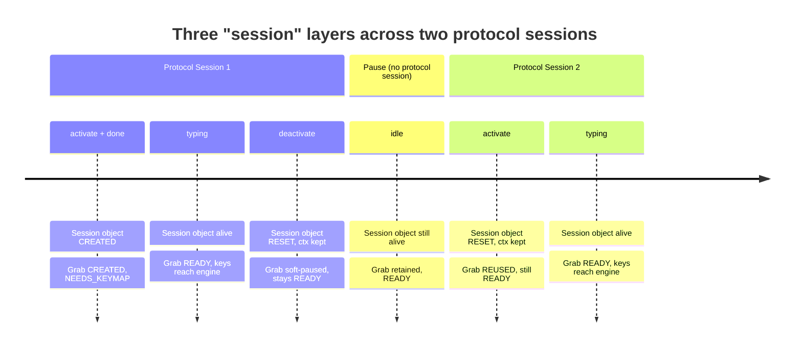

# Wayland Input-Method v2 Session

## Purpose

This document describes the lifecycle of a Wayland input-method engagement in
typio-linux — from the moment the compositor gives the daemon focus, through
keyboard-grab setup and key routing, to teardown and recovery.

One naming hazard runs through all of it: three things span that engagement
with **different lifetimes**, and two of them are called "session." Telling
them apart is what separates a precise focus/grab/preedit bug report from a
vague one, so the next section pins them down before the lifecycle detail.

See also: the upstream protocol spec
([`input-method-unstable-v2.xml`](https://gitlab.freedesktop.org/wayland/wayland-protocols/-/blob/main/unstable/input-method/input-method-unstable-v2.xml));
the control model that manages the grab resource
([Focus Controller](focus-controller.md)); event-loop scheduling
([Event Loop Scheduling](event-loop-scheduling.md)).

## Three Lifetimes to Keep Separate

Three things span an input-method engagement, each with a **different**
lifetime. Two carry the word "session"; the third is the focus controller's
resource (it was the "session controller" until that name was dropped to stop
exactly this collision). Confusing the three is the most common source of vague
focus/grab bug reports.

| Concept | What it is | Lifetime | Owner |
|---------|-----------|----------|-------|
| **Protocol session** | One `activate` → `deactivate` cycle on `zwp_input_method_v2` | compositor `activate` → `deactivate` | compositor |
| **Session object** (`TypioWlSession`) | The C struct wrapping `TypioInputContext` + editing-context facts | first `activate` → frontend teardown | daemon |
| **Grab / focus lifecycle** | The keyboard-grab + vk-keymap resource | `desired.grab = YES` → `NONE` | [focus controller](focus-controller.md) |

The first two are detailed below; the third is the [focus controller](focus-controller.md)'s
domain and is only summarized here.

### Protocol Session

The compositor owns this concept. It begins when the compositor sends
`zwp_input_method_v2::activate` and ends when it sends `deactivate`.
Events inside one session travel through the protocol object the daemon
bound at startup.

A protocol session is **not** always followed by a full teardown:

- **Normal deactivate** ends the protocol session but the daemon may retain
the keyboard grab in a **soft pause** so the next activation skips the
expensive rebuild (xkb keymap compile, Wayland grab create, `NEEDS_KEYMAP`
window).

- **Reactivation** (`activate` while already active, with no intervening
`deactivate`) extends the same protocol session. The compositor moved focus
to a new text field inside the same window. The daemon keeps the grab and
the engine's in-flight composition, refreshing only the Panel anchor.

The `done(serial)` event is the compositor's double-buffer commit point.
Events in a batch (`activate`, `deactivate`, `surrounding_text`, …) are
provisional until `done` commits them atomically. The daemon records them as
facts and classifies the batch at `done` time; see
[ADR-0018](../adr/0018-focus-transition-classification.md).

### Session Object

`TypioWlSession` is a C struct that wraps the libtypio `TypioInputContext`
and buffers editing-context facts (`surrounding_text`, `content_type`, …).

Lifetime rules:

- **Created** on the first `activate` if none exists (`im_handle_activate` →
`typio_wl_session_create`).
- **Reset** on every subsequent `activate` (`typio_wl_session_reset`),
clearing pending facts but preserving the `ctx`.
- **Destroyed** only on `frontend` teardown (`typio_wl_session_destroy`),
which calls `focus_out` on the engine and frees the context.

The session object **survives** `deactivate`. It is not tied one-to-one to
the protocol session. This matters for two reasons:

1. The engine's in-flight composition survives a soft pause. A quick
focus-out/focus-in (clicking from one field to another) does not reset the
engine.
2. `surrounding_text` and `content_type` are cached across activations so
the engine sees context immediately on re-focus.

### Grab / Focus Lifecycle

This is the availability of the unified keyboard-grab + vk-keymap resource —
**not** a protocol object and **not** a C struct instance. It can outlive a
protocol session (soft pause) and be rebuilt across protocol sessions (resume,
reconnect).

It is owned by the **focus controller**, whose `reduce`/`diff`/`apply` pipeline
converges it onto the desired state derived from input facts. Its readiness
states (`ABSENT → NEEDS_KEYMAP → READY → BROKEN`), the state diagram, and the
rules that govern them are the mechanism's single source of truth — see
[Focus Controller § Actual State](focus-controller.md#actual-state).

## Build-up Chain

The most failure-sensitive chain is the **build-up order** that lifecycle
transitions must preserve when bringing a focused session to a state where
keys reach the engine and unhandled keys reach the app:

1. `zwp_input_method_v2` activation (a focus fact arrives)
2. keyboard-grab creation
3. compositor keymap delivery on the grab
4. keymap forwarding into `zwp_virtual_keyboard_v1`
5. virtual-keyboard transition to `ready`
6. only then: unhandled-key forwarding to the focused application

If that chain is incomplete or reordered, the frontend must not behave as if
virtual-keyboard forwarding is healthy.

If a keyboard or focus bug appears "sometimes", treat it as a build-up-chain
problem first, not as a one-off key handling bug.

## Truth Sources

Each input fact has exactly one source. Facts are recorded, never interpreted
at arrival:

| Fact | Source |
|------|--------|
| `activate / deactivate / done(serial)` | focus + the compositor double-buffer commit point |
| `key press / release` | physical key truth (carries the current grab epoch) |
| `modifiers` | modifier-mask truth |
| `repeat_info / repeat timer` | repeat truth |
| `surrounding_text / content_type` | client editing context |
| suspend gap, connection up/down | environment truth |
| virtual keyboard output | **side effect only, never a source of internal truth** |

Do not derive lifecycle truth from forwarded virtual-keyboard output.
Additionally:

- a live keyboard grab is not proof that the virtual keyboard is ready
- a previously healthy virtual keyboard is not proof that the current grab
  has a current keymap

`typio_wl_focus_observe()` is a **view of reality, never a stored second
source of truth**, so the observed snapshot cannot drift from the resources
it describes.

## Ownership

| Module | Responsibility |
|--------|---------------|
| `focus_controller.{c,h}` | pure lifecycle decisions (`reduce`, `diff`) and the data structures that describe them |
| `focus_effects.c` | `observe` (live resource snapshot) and `apply` (effectful execution of the diff) |
| `tracker.{c,h}` | the per-key generation stamp and symmetric press/release tracking — mutable, and **never** the routing decision |
| `router.{c,h}` | the pure routing decision `(key, mods, state) → {action, reason}` |
| `keyboard.c` | key-event interpretation (XKB → `TypioKeyEvent`) while the session is focused |
| `bridge.c` | virtual-keyboard health, keymap deadlines, readiness gating, and fail-safe downgrade |
| `event_loop.c` | poll scheduling, bounded auxiliary-fd dispatch, and deadline-aware wakeups |
| `runtime_config.c` | config-watch events, debounce timing, watch rearming, and the runtime reload boundary |
| `pw_capture.c` | voice recording/inference state and deferred voice reload application |
| `xkb_state` | the logical modifier view |
| engine implementations | only engine/composition behavior |

The status D-Bus surface exports this state but does not own it.
`RuntimeState` is a read-only projection of `observe()`, not an independent
tracker.

## Relationship Diagram

Key observations from the diagram:

- `TypioWlSession` lives across both protocol sessions.
- The grab is created once, stays `READY` through the soft pause, and is
reused on the second activation.
- The focus controller's `desired.grab` transitions `YES → SOFT_PAUSE → YES`.
No `destroy_grab` effect fires during the soft pause.

## Grab Readiness

The keyboard grab and its virtual-keyboard keymap handshake are **one
resource** with a single readiness state (`absent → needs_keymap → ready →
broken`) — no separate phase plus vk state machine plus "non-routable grab"
rescue branch. Keys route to the engine only when the resource is `ready`.

The readiness states, their state diagram, and the epoch rules that govern
them (new epoch on rebuild, old `ready` never survives, modifier-vs-key gating
during `needs_keymap`) are owned by the focus controller — see
[Focus Controller § Actual State](focus-controller.md#actual-state).

## Engine Availability

Grab readiness is necessary but not sufficient. The active keyboard engine also
has an availability state from `libtypio`:

- `TYPIO_ENGINE_READY`: key routing may call `typio_input_context_process_key`
- any other value: key press/release is consumed locally as
  `TYPIO_KEY_TRACK_ENGINE_NOT_READY`

This prevents an engine that is still deploying or loading data from returning
`NOT_HANDLED` and leaking raw keys to the focused application. A not-ready key
cycle never starts repeat and never emits virtual-keyboard events.

## Generation Fence

"A key from before this grab is untrusted" is enforced by the active key
generation. Every new grab generation increments `active_key_generation`; a key
press claims that generation, and the matching release is accepted only when the
stored `key_generations[key]` still matches. A compositor re-send of an
already-held key across a rebuild, suspend, or reconnect is dropped because its
generation does not match the active grab.

`created_at_epoch` remains only as a short orphan-release cleanup window for
keys that were physically held before the grab existed. It must not be used to
suppress fresh key presses.

## Teardown

Every transition that ends a grab — focus loss, suspend, reconnect, fail-safe,
or observed-axis repair — runs the **same** teardown path:

- forwarded keys are released to the virtual keyboard
- virtual-keyboard modifiers are reset to zero (exception below)
- key repeat is cancelled
- the grab object is destroyed and a new epoch is begun
- per-key tracking is cleared
- any stale assumption that vk is `ready` is discarded; the next epoch must
  re-earn `ready`

The one exception is a focus handoff (the derived `activating`-from-focused
case): the last compositor-reported modifier mask may be carried to the virtual
keyboard so the newly focused client can still observe a held shortcut modifier.
Carried modifier state must be cleared before the next grab is built. A
suspend/reconnect teardown carries nothing — a modifier held across the boundary
produced no key-up and is dropped unconditionally.

## Recovery

Recovery shares the normal path **only for divergences the observed axes can
see**. Observation reads resource *presence*, not external liveness, so the
focus controller's diff is a backstop for internal state drift, not a detector
of silent compositor-side grab death:

- **Internal divergence** — the grab object is missing while `desired.grab` is
  still `YES`. `observe()` reports `ABSENT`, so the diff recreates the grab on
  the next tick.
- **Suspend/resume** — a grab dead across suspend can leave a live proxy, which
  observation cannot distinguish from a healthy one. A resume detector records
  the gap fact and invalidates the grab generation; the next tick rebuilds. The
  input context is never `focus_out`'d, so the engine's in-flight composition
  survives.
- **Compositor reconnect** — connection death surfaces as `POLLHUP`; the lost
  connection forces `desired.grab = NONE` and a full teardown, and the fresh
  `activate` on reconnect drives the rebuild. Engine/session state, aux
  handlers, the config watch, and the resume detector are preserved.

A grab the compositor orphans with *no* protocol event, suspend, or disconnect
is invisible to observation and is **not** auto-recovered. The focus controller
can only act on facts it can see.

### Suspend without deactivate

The compositor may not send `deactivate` before the system sleeps. The
resume detector sets `suspend_gap_detected = true`, which forces
`desired.grab = NONE`. The grab resource is torn down and rebuilt
proactively, even though no protocol session boundary was crossed.

### Compositor restart without events

The compositor crashes and restarts. The Wayland socket stays open (no
`POLLHUP`) but the new compositor does not restore the old grab. The
protocol session is still "active" from the daemon's point of view, but the
grab resource is silently dead. This is the **dead-but-present** blind spot:
the focus controller's `observe()` sees a live proxy, so `diff` produces no
effects. Recovery requires an external fact source (resume detector or future
liveness probe); see [Focus Controller](focus-controller.md) § Blind
Spot.

### Engine switch mid-session

`Ctrl+Shift` switches engines internally. This is **not** a protocol event,
so it does not start a new protocol session. The old engine's preedit is
cleared, the Panel is hidden, and the new engine receives `focus_in` on the
same `TypioInputContext`. The grab resource stays `READY` throughout.

## Shortcut Policy

Application shortcuts are decided in the Wayland frontend, as a pure routing
decision:

- routing yields two independent dimensions: `action` (`consume` / `forward`)
  and `reason`; the per-key tracker records lifecycle history (forwarded,
  app-shortcut) for symmetric release, and is **not** the routing model
- non-modifier keys with Ctrl, Alt, or Super bypass the engine; the matching
  release must also bypass it
- Typio-reserved shortcuts (emergency exit, voice PTT) are consumed internally
  and never treated as virtual-keyboard forwarding
- emergency exit is the highest-priority reserved decision on key press: dump
  recent logs, release the grab, stop the frontend — it forwards no key
- engines do not each implement shortcut bypass; `Ctrl+Shift`-style
  modifier-only shortcuts stay transparent to the app/compositor
- on `Ctrl+Shift` engine switch completion, the arbiter clears the old engine's
  composition, the compositor-facing preedit, and the candidate panel before
  activating the new engine

## Invariants

- lifecycle transitions must go through the lifecycle helpers and stay valid
  under `typio_wl_lifecycle_transition_is_valid`
- observed lifecycle axes must be used to detect declared-phase drift, not as
  a second mutable phase model
- no key press/release is processed unless the grab resource is `ready`
- no key press reaches the engine unless the active keyboard engine is
  `TYPIO_ENGINE_READY`
- modifier-mask updates may be processed while `needs_keymap` to resynchronize
  held modifiers
- no virtual-keyboard forwarding happens unless vk is explicitly `ready`
- a key whose stored generation does not match the current grab generation is
  dropped at routing
- no per-key tracking state survives a teardown
- application shortcut press/release stays symmetric
- a rebuilt grab never inherits prior-epoch keymap health
- a grab **retained** across a soft pause (focus-out that keeps the grab to
  skip rebuild) must still shed host-side input-arbitration state —
  `physical_modifiers`, `saw_blocking_modifier`, and the shortcut arbiter —
  so a modifier held at defocus, whose release the routing guard drops, cannot
  phantom-persist into the next activation and corrupt chord detection
- fail-safe paths prefer releasing the grab over running partially broken
- an engine-switch failure must not silently clear the previously active engine
  in that category
- engine switch clears composition, preedit, and candidate panel before the
  new engine activates — no stale underlined text survives an engine boundary

## Test Expectations

Session lifecycle regressions should be covered by:

- `focus_controller` tests: `reduce` / `diff` decisions, done-event
  classification, and guard predicates
- `state_machine_properties` tests: derived-state convergence and observed-axis
  divergence handling
- `key_tracking` tests: generation fencing and symmetric press/release across
  teardown
- routing tests: pure `(key, mods, state)` decisions including reserved
  shortcuts
- vk state-machine tests: `needs_keymap` / `ready` / `broken` / keymap-timeout
  transitions
- repeat tests: states that must not repeat, including `ENGINE_NOT_READY`

Every guard deleted from the old model (startup suppression, boundary carry,
divergence repair) must first be re-expressed as a failing focus-controller,
state-machine-properties, or helper-policy test before its imperative code is
removed.

## See Also

- [Focus Controller](focus-controller.md) — the control model that
  manages grab resources
- [Event Loop Scheduling](event-loop-scheduling.md) — GPU bounds,
  D-Bus dispatch, config reload, and poll deadlines
- [Wayland Input Method Protocol](wayland-input-method.md) — how the daemon
  implements the protocol handlers
- [ADR-0018: Focus Transition Classification](../adr/0018-focus-transition-classification.md)
  — how `done` classifies `activate` into activation, reactivation, or no-op
- [ADR-0003: Session Controller — Derived State, Idempotent Diff](../adr/0003-session-controller-reduce-diff.md)
  — the architectural decision that introduced the reduce/diff/apply model
