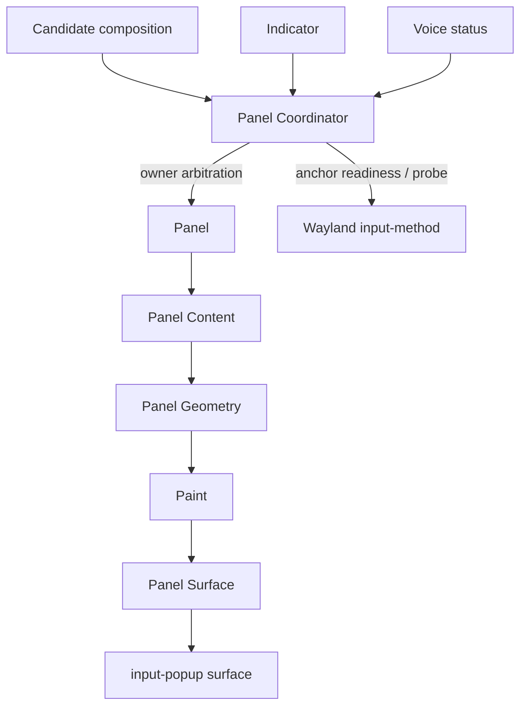

# Panel Ontology

Typio has one floating IME UI: the **Panel**. It may look like several
different things during use — candidate list, engine/profile indicator, voice
recording status — but those are different **owners** of the same Panel, not
different windows.

This document names the concepts around that UI and explains how they relate.
It complements [Frontend Graphics](frontend-graphics.md), which explains how
the Panel is drawn, and ADR-0014 / ADR-0017, which record the naming and
arbitration decisions. Terminology follows ADR-0014: **Panel** is the UI;
**input-popup surface** is the Wayland protocol role.

## The core ontology

| Concept | Meaning | Code home |
|---|---|---|
| **Panel** | The single floating IME UI surface. It can show candidates, indicator text, or voice status. | `src/ui/panel/panel.c` |
| **Panel Surface** | The Wayland/Vulkan presentation object behind the Panel. It owns the input-popup `wl_surface`, swapchain, present/recover loop, scale, and output tracking. | `src/ui/panel/surface.c` |
| **Panel Content** | Display-agnostic data describing what to show. It has no Wayland or GPU types. | `src/ui/panel/content.h` |
| **Zone** | A bounded area inside Panel content, such as Candidate, Preedit, Status, or future Toolbar. | `src/ui/panel/content.h`, `layout.c` |
| **Panel Producer** | A frontend subsystem that requests Panel content. Current producers are candidate composition, indicator, and voice. | `src/frontend/*` |
| **UI Owner** | The producer currently allowed to control Panel visibility. | `src/frontend/panel_coordinator.c` |
| **Panel Coordinator** | Frontend policy layer that arbitrates owners, pending positioned UI, and anchor readiness. It is not renderer code. | `src/frontend/panel_coordinator.c` |
| **Position Anchor** | The current activation's trusted placement state for the input-popup surface. | `src/frontend/panel_coordinator.c` |
| **Anchor Probe** | A one-shot no-op input-method commit used to ask clients such as browsers for a fresh caret rectangle. | `src/frontend/panel_coordinator.c` |

## Layer boundaries

The Panel system is split into two large areas.

### Frontend policy

The frontend knows about Wayland focus, input-method commits, voice state,
engine mode changes, and browser anchor quirks. That policy belongs under
`src/frontend/`.

The main frontend policy object is the **Panel Coordinator**. It answers:

- who currently owns the Panel;
- whether a new producer may replace the current owner;
- whether a hide event is stale;
- whether positioned UI must wait for an anchor;
- whether to send an anchor probe.

### Panel rendering

Rendering belongs under `src/ui/panel/`. It answers:

- how content becomes geometry;
- how geometry becomes paint commands;
- how glyphs are shaped and cached;
- how the surface presents and recovers from compositor stalls.

Rendering does not know whether content came from voice, indicator, or
candidate composition. It receives `TypioPanelContent` and draws it.

## Owners and mutual exclusion

The Panel has exactly one visible owner at a time:

| Owner | Producer | Typical content |
|---|---|---|
| `CANDIDATE` | keyboard composition | candidates, preedit, optional mode label |
| `INDICATOR` | engine/profile changes | active engine and profile label |
| `VOICE` | voice session | loading, recording, processing, unavailable, error |

The current policy is temporal: a later owner replaces the current owner. A
hide request only hides the owner that issued it. This prevents stale events,
such as an old indicator timer, from hiding a newer candidate panel.

Candidate UI has one extra rule: when candidates arrive, pending positioned
status UI is cancelled. Typing is the highest-signal evidence that the user is
actively composing, so candidate UI should not be delayed behind an old status.

## Position anchors

The compositor positions the input-popup surface near the text input area, but
the input method does not own global caret coordinates. The Panel therefore
tracks whether the current activation has a trustworthy **position anchor**.

Each activation receives an **anchor generation**. That generation becomes ready
when either:

- the compositor sends `text_input_rectangle`;
- candidates successfully present for the current activation.

Candidates can establish the anchor because they are input-driven. Browsers
often update caret rectangles only after real input-method traffic, so candidate
placement is usually reliable even when out-of-band status UI is not.

## Anchor probe

Indicator and voice status are out-of-band UI. They may need a cursor position
even though the application has not recently updated text-input state.

When such positioned status UI is requested without a ready anchor, the Panel
Coordinator can send one **anchor probe** for the current generation:

```text
set_preedit_string("", -1, -1)
commit(current_serial)
```

The probe is intentionally no-op from the user's point of view. Its purpose is
to make clients that refresh caret rectangles on input-method commits, notably
Chrome and Firefox, send a fresh `text_input_rectangle`.

The probe is enabled by default:

```toml
[display]
anchor_probe = true
anchor_probe_timeout_ms = 150
```

If the anchor still does not become ready before the timeout, the pending status
UI is dropped rather than shown at a stale location.

## The data flow



The important split is that producer arbitration happens before rendering.
Rendering is downstream and should not contain ownership policy.

## Vocabulary to use in code and docs

Use these terms consistently:

| Prefer | Avoid | Reason |
|---|---|---|
| Panel | popup, candidate popup | Panel is the UI; popup is only the Wayland role. |
| input-popup surface | popup surface, window | Names the protocol role precisely. |
| Panel Producer | UI source, caller | Producer states who requests content. |
| UI Owner | active UI, current status | Owner explains visibility authority. |
| Panel Coordinator | UI manager, frontend UI | Coordinator describes arbitration without implying rendering. |
| Position Anchor | popup position, cursor position | Anchor is the trustworthy placement state, not raw coordinates. |
| Anchor Readiness | fresh rect, valid position | Readiness describes whether the current activation can be trusted. |
| Anchor Probe | refresh hack, browser workaround | Probe describes the explicit no-op commit mechanism. |

## Design rules

1. Do not let producers call `TypioPanel` directly. Route through the Panel
   Coordinator.
2. Do not put owner or anchor policy in `src/ui/panel/`. That tree is rendering.
3. Do not let stale owner events hide the current owner.
4. Do not show positioned status UI at an untrusted anchor.
5. Treat candidates as both UI content and anchor-producing evidence.
6. Keep `popup` reserved for protocol names.

## See also

- [Frontend Graphics](frontend-graphics.md)
- [Wayland Input Method Protocol](wayland-input-method.md)
- [ADR-0014: Canonical panel vocabulary and module ontology](../adr/0014-canonical-panel-vocabulary.md)
- [ADR-0017: Positioned UI arbitration for panel owners](../adr/0017-positioned-ui-arbitration.md)
